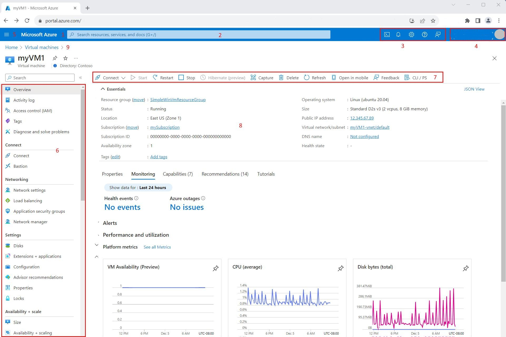
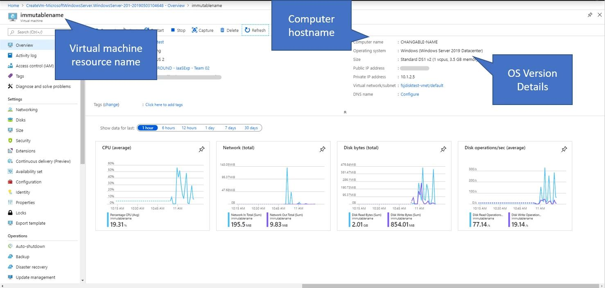
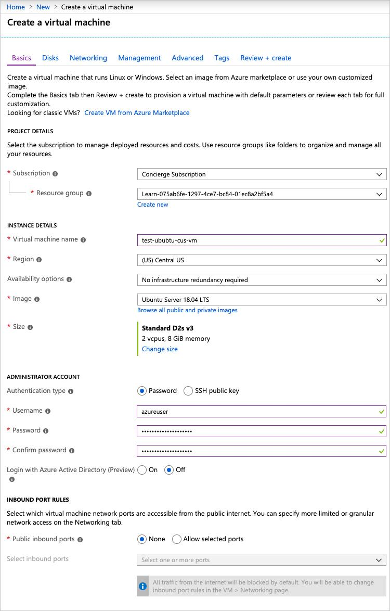
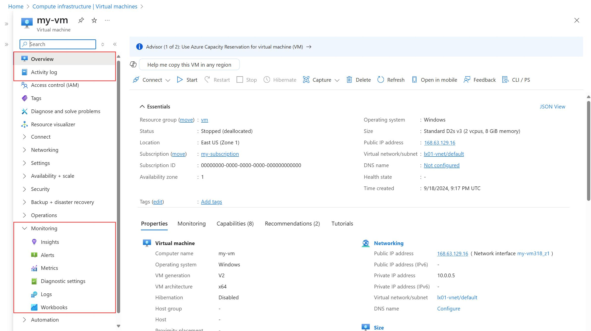
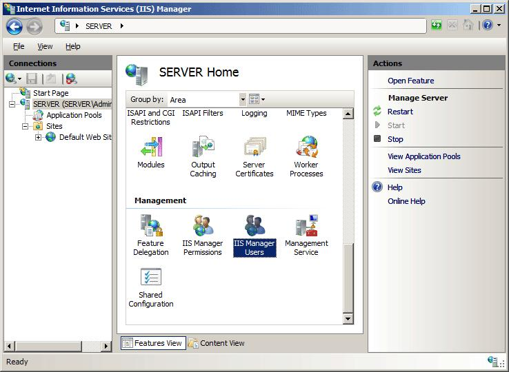
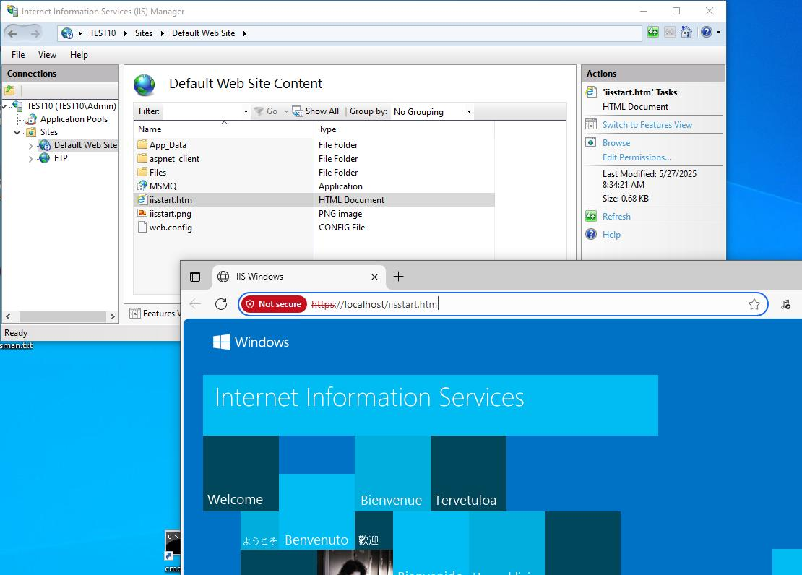

# Azure VM Monitoring Project

This project demonstrates Azure VM monitoring and basic SRE infrastructure operations.

## Features
- Azure Virtual Machine setup
- IIS Web Server configuration
- VM health monitoring
- CPU and Memory monitoring
- Infrastructure troubleshooting
- Monitoring alerts

## Technologies Used
- Microsoft Azure
- Windows Server
- IIS
- Azure Monitor
- PowerShell

## Monitoring Activities
- CPU Utilization Check
- Memory Usage Monitoring
- Disk Health Monitoring
- Service Availability Monitoring

## Future Improvements
- Email Alerts
- Automated Health Checks
- Log Analytics Integration

## Purpose
This project was created to learn Cloud Infrastructure Monitoring and Site Reliability Engineering (SRE) operations.

## Screenshots

### Azure Portal

### Azure VM

### IIS Server

